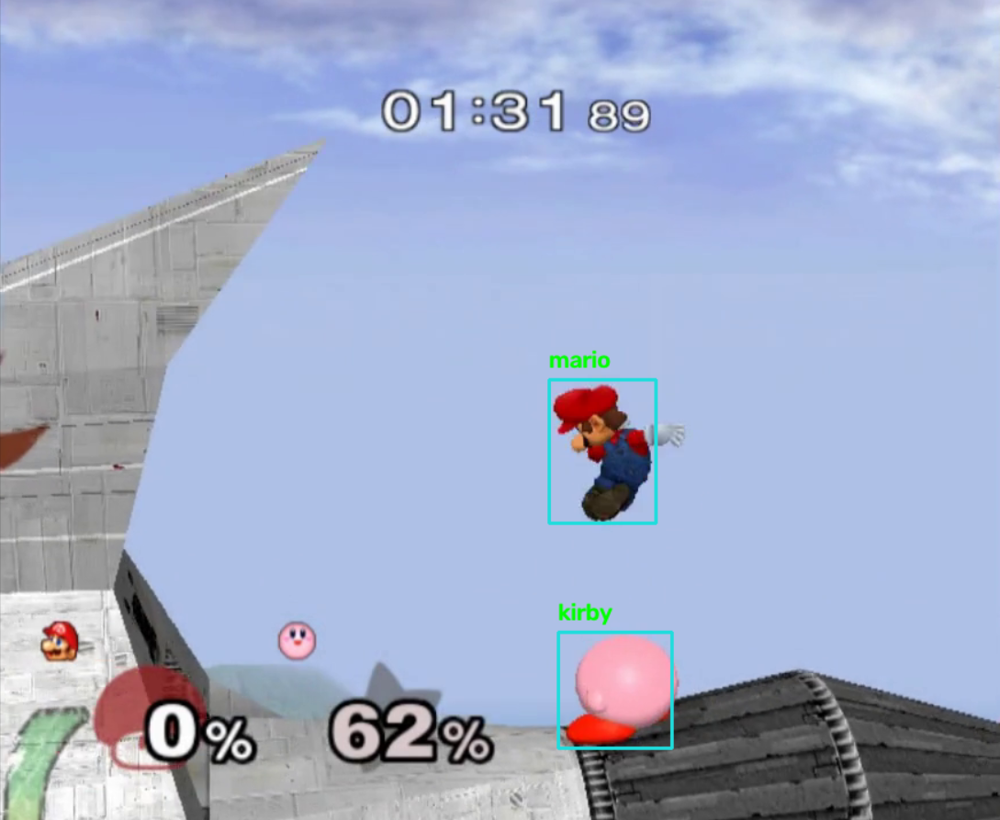
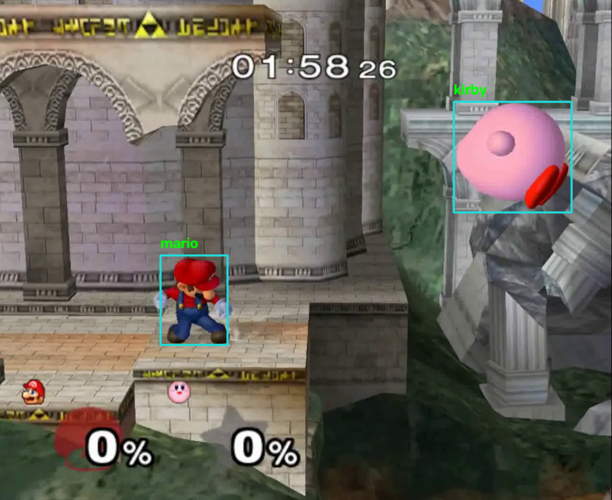
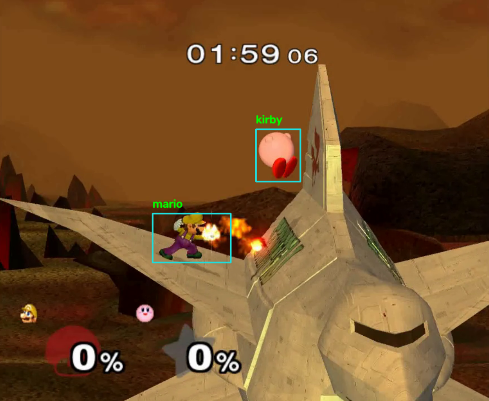

# SSBM Character Analysis

<br>
<div style="display: flex; justify-content: center; gap: 10px;">
  
  
  
</div>
<br>

Super Smash Bros. Melee Character Analysis (SSBMCA) is an experimental computer vision pipeline for exploring the detection, tracking, and identification of player characters in Super Smash Bros. Melee gameplay footage using classical image processing techniques. This project investigates how image segmentation, contour analysis, temporal tracking, and different combinations of visual features can be used to extract gameplay information from video. The current implementation supports a limited set of stages and characters, however its data-driven design allows additional stages and character templates to be incorporated.

This system is intended as an experimental foundation rather than a complete solution, with particular attention to challenges such as occlusion, dynamic visual effects, and changing stage appearances. Please see the accompanying paper for more information, located at [/paper/ssbm_character_analysis.pdf](./paper/ssbm_character_analysis.pdf).

## Table of Contents

- [SSBM Character Analysis](#ssbm-character-analysis)
  - [Table of Contents](#table-of-contents)
  - [Prerequisites](#prerequisites)
  - [Command Line Options](#command-line-options)
    - [Subcommands](#subcommands)
      - [`init`](#init)
      - [`run`](#run)
  - [Running with Test Videos](#running-with-test-videos)
    - [Quick Start Example](#quick-start-example)
    - [Visualizing with Debug](#visualizing-with-debug)
  - [Running Test Suite](#running-test-suite)
  - [Analyzing Results](#analyzing-results)

## Prerequisites

This program is built with Python, to install python download the latest version of Python 3 from `https://www.python.org/`.

**Python Version:** Python 3.10 or higher recommended.

This project uses `OpenCV`, `scipy`, `scikit-image`, and `numpy`. These modules can be installed directly by running:

```bash
python -m pip install opencv-python numpy scipy scikit-image
```

or by using the supplied `requirements.txt`:

```bash
python -m pip install -r ./requirements.txt
```

**NOTE:** This project relies on pre-compiled templates for actor matching which are located in the `/data/templates/` directory. More templates can be added but are expected to follow the naming and organization convention present in the templates directory.

## Command Line Options

```bash
python ./src/main.py <subcommand> [options]
```

### Subcommands

#### `init`

Initialize the sprite template database. This produces a `.json` file that can be reused across runs using the `run` command.

```bash
python ./src/main.py init [-s <sprites_dir>] [-o <output_file>] [-f <feature ...>]
```

| Argument | Short | Required | Type | Default | Choices / Format | Description |
| --- | --- | --- | --- | --- | --- | --- |
| `--sprites-dir` | `-s` | No | `str` | `./data/templates` | Directory path | Path to sprite template directory. |
| `--output` | `-o` | No | `str` | *None* | File path | Path to store the generated sprite template database `.json`. |
| `--features` | `-f` | No | `list` | *None* | `fd`, `hu`, `sat`, `hsv`, `lbp` | One or more features to extract for classification. |

---

#### `run`

Run the SSBMCA video analysis pipeline.

```bash
python ./src/main.py run -i <path_to_video> -s <stage> [--output {stdout,file}] [--file <output_file>] [--index <path>] [-f <feature ...>] [--debug]
```

| Argument | Short | Required | Type | Default | Choices / Format | Description |
| --- | --- | --- | --- | --- | --- | --- |
| `--input` | `-i` | **Yes** | `str` | *None* | File path | Path to the input video file to analyze. Relative paths are resolved against the project root. |
| `--stage` | `-s` | **Yes** | `str` | *None* | `temple`, `corneria`, `venom` | Name of the stage to use for analysis. |
| `--output` |  | No | `str` | `stdout` | `stdout`, `file` | Destination for the analysis output stream. |
| `--file` |  | Conditional | `str` | *None* | Must end in `.jsonl` | File path for output destination. **Required** if `--output` is set to `file`. |
| `--index` |  | Yes | `str` | *None* | File path (`.json`) | Path to the template index generated by the `init` command. |
| `--features` | `-f` | No | `list` | *None* | `fd`, `hu`, `sat`, `hsv`, `lbp` | Features to use for classification. Must match the features specified during `init`. |
| `--debug` |  | No | Flag | `False` | N/A | Enables debug mode during pipeline processing. Video advances frame-by-frame on `Space` press. |

## Running with Test Videos

Three test recordings are provided and located in `\test\recordings` including `corneria.mp4`, `temple.mp4`, and `venom.mp4`.
To run the pipeline for a video, make sure the stage name matches the file name of the video (e.g., `--stage corneria` for video file `corneria.mp4`).
Output can be chosen between `stdout` and a `jsonl` file. See [Command Line Options](#command-line-options) for more information.

```bash
# Run the pipeline with the generated features.json
python ./src/main.py run --input <path-to-video> --stage <stage-name> --index <path-to-init-file> --output <output> --features [features]
```

Detection is dependent on stage-specific masking, however automated stage detection is beyond the scope of this project, so the stage name must be specified as a program argument.
Supported stage names include:

- temple
- corneria
- venom

### Quick Start Example

Below is an example command to run the pipeline on the provided `temple.mp4` gameplay video and print the results to the console:
```bash
# Init the template database index file with the features [hsv, hu]
python ./src/main.py init --output ./features.json --sprites-dir ./data/templates/ --features hu,hsv

# From the root directory, run the pipeline for the provided gameplay in the 'temple' stage with the generated features.json file
python ./src/main.py --input ./test/recordings/temple.mp4 --stage temple --index ./features.json --features hu,hsv
```

Below is an example command to run the pipeline on the provided `temple.mp4` gameplay video and write the results to a json-lines file for analysis:
```bash
# From the root directory, run the pipeline for the provided gameplay in the 'temple' stage
python ./src/main.py --input ./test/recordings/temple.mp4 --stage temple --output file --file=./results.jsonl
```

### Visualizing with Debug

The `--debug` flag allows you to run the pipeline with debug visuals enabled which display a window with characters and HUD elements
visualized.

**NOTE:** Frames can be advanced by clicking the `Space` key:

```bash
# Visualize results of game state prediction. Press Spacebar to advance frames
python ./src/main.py -i path/to/match.mp4 -s <stage-name> --index <path-to-init-file> --features [features] --debug

```

## Running Test Suite

The tests run as part of the accompanying paper are included in the test suite script located at `./tools/test_suite.py`.
From the root directory, this can be run with:
```bash
python ./tools/test_suite.py 
```

This will run all test cases for all feature combinations across each stage and aggregate results into a `test_results/` folder. This automatically runs the analysis script described in [Analyzing Results](#analyzing-results) and requires the ground truth data files to exist in `./tests/labels`.

## Analyzing Results

If the pipeline is run manually and results are stored in a `.jsonl` file, they can be analyzed using the provided `analyze_results.py` file located in the `/tools/` folder. The analysis requires a valid results file produced by the pipeline and the corresponding ground truth file for that video located in `./tests/labels/`.
Example:
```bash
# Analyze results.jsonl produced for the 'temple.mp4' video against the ground truth
python ./tools/analyze_results.py --results ./results.jsonl --ground-truth ./tests/labels/temple.json --json
```

This will print the performance and accuracy metrics found in the supporting paper to the console.
